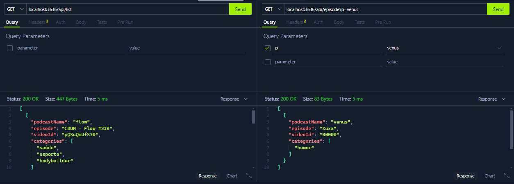

# 🎧 Podcast Manager

## 📌 Descrição

O **Podcast Manager** é uma aplicação inspirada na interface da Netflix, criada para centralizar episódios de podcasts em vídeo, organizando-os por categorias como saúde, esportes, humor, entre outros.

A proposta é oferecer uma navegação simples, rápida e agradável, facilitando o acesso a conteúdos diversos de maneira visualmente atrativa.

---

## 🚀 Funcionalidades

- 🎲 **Organização por categorias:** Episódios agrupados por temas como saúde, bodybuilder, mentalidade e humor.
- 🔍 **Filtro por nome do podcast:** Permite buscar episódios digitando o nome do podcast.

---

## 🔌 Endpoints da API

### ✅ Listar episódios por categorias

- **Rota:** `GET /list`  
- **Descrição:** Retorna todos os episódios organizados por categoria.

#### 🧪 Exemplo de resposta:

```json
[
  {
    "podcastName": "flow",
    "episode": "CBUM - Flow #319",
    "videoId": "pQSuQmUfS30",
    "cover": "https://i.ytimg.com/vi/pQSuQmUfS30/maxresdefault.jpg",
    "link": "https://www.youtube.com/watch?v=pQSuQmUfS30",
    "categories": ["saúde", "esporte", "bodybuilder"]
  },
  {
    "podcastName": "flow",
    "episode": "RUBENS BARRICHELLO - Flow #339",
    "videoId": "4KDGTdiOV4I",
    "cover": "https://i.ytimg.com/vi/4KDGTdiOV4I/maxresdefault.jpg",
    "link": "https://www.youtube.com/watch?v=4KDGTdiOV4I",
    "categories": ["esporte", "corrida"]
  }
]
```

---

### ✅ Filtrar episódios por nome do podcast

- **Rota:** `GET /episode?podcastName={nome}`  
- **Descrição:** Retorna os episódios que correspondem ao nome do podcast informado.

#### 🧪 Exemplo de requisição:

```
GET /episode?podcastName=flow
```

---

## 🛠️ Tecnologias Utilizadas

- [**TypeScript**](https://www.typescriptlang.org/)
- [**Tsup**](https://github.com/egoist/tsup)
- [**Tsx**](https://github.com/egoist/tsx)
- [**Node.js**](https://nodejs.org/)
- [**@types/node**](https://www.npmjs.com/package/@types/node)

---

## ▶️ Como Rodar o Projeto

1. Clone o repositório:
   ```bash
   git clone https://github.com/devbdallagnol/node_fundamentals.git
   ```

2. Instale as dependências:
   ```bash
   npm install
   ```

3. Inicie o servidor em modo desenvolvimento:
   ```bash
   npm run start:dev
   ```

4. Acesse os endpoints para listar ou buscar episódios.

---

## 🤝 Contribuições

Contribuições são super bem-vindas!  
Se você encontrou um bug, tem uma sugestão ou quer adicionar algo novo, sinta-se à vontade para abrir uma _issue_ ou enviar um _pull request_.

---

## 📄 Licença

Este projeto está sob a licença [MIT](LICENSE).

---

