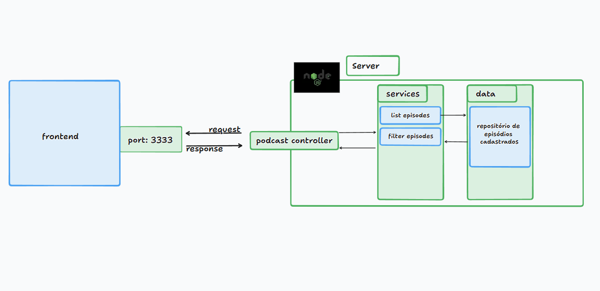

# Nome do Aplicativo

Podcast Manager

### Descrição

Um app ao estilo Netflix aonde eu possa centralizar diferentes episódios separados por categoria

### Domínio

Podcasts - feitos em vídeo

### Funcionalidades / Features

- Listar os episódios podcasts em seções de categorias
  - [saúde, bodybuilder, mentalidade, humor]
- Filtrar episódios por nome de podcasts

## Como

#### Feature

### Como vou implementar:

GET: retorna lista de episódios

response:
```js
[
  {
    podcastName: "flow",
    episode: "CBUM - flow #319",
    videoId: "pQSuQmUfS30",
    cover:"https://i.ytimg.com/vi/pQSuQmUfS30/hqdefault.jpg",
    link: "https://www.youtube.com/watch?v=pQSuQmUfS30",
    categories: ["saúde", "esporte", "bodybuilder"],
  },
  {
    podcastName: "flow",
    episode: "RUBENS BARRICHELLO - Flow #339",
    videoId:"4KDGTdiOV4I",
    cover: "https://i.ytimg.com/vi/4KDGTdiOV4I/maxresdefault.jpg",
    link: "https://www.youtube.com/watch?v=4KDGTdiOV4I",
    categories: ["esporte", "corrida"]
  },
];
```

#### Arquitetura Básica do Projeto


